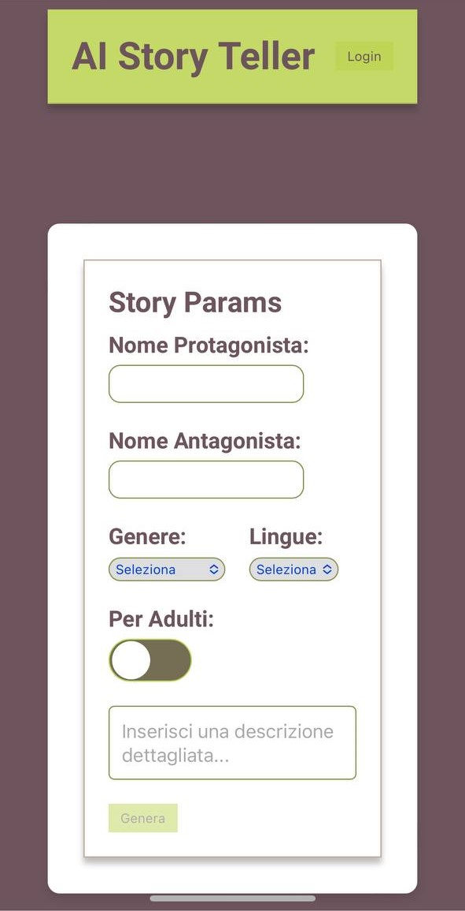

# AI Story Teller




## 🚀 Panoramica del Progetto

AI Story Teller è un'applicazione che genera racconti personalizzati utilizzando l'intelligenza artificiale. Gli utenti possono inserire nomi di protagonisti e antagonisti, scegliere il genere del racconto e la lingua, e decidere se il racconto è per adulti o bambini. Il progetto sfrutta tecnologie moderne come React e Next.js per creare un'esperienza utente interattiva e dinamica.

### Funzionalità Principali

- **Generazione di Racconti Personalizzati**: Crea racconti unici inserendo i dettagli del protagonista, antagonista, genere e lingua.
- **Controllo per Adulti/Bambini**: Usa uno switch per selezionare se il racconto è destinato a un pubblico adulto o per bambini.
- **Sintesi Vocale**: Ascolta il racconto generato utilizzando voci selezionabili (maschio, femmina, bambino).
- **Interfaccia Reattiva**: L'applicazione è ottimizzata per dispositivi mobili con un layout adattabile.
- **Notifiche Toast**: Mostra feedback agli utenti in modo elegante utilizzando notifiche stile toast.

## 🛠️ Tecnologie Utilizzate

- **React**: Per costruire l'interfaccia utente e gestire lo stato dell'applicazione.
- **Next.js**: Per la gestione delle pagine e della navigazione lato server.
- **SCSS**: Per la stilizzazione dell'applicazione con l'uso di mixin e funzioni.
- **CSS Modules**: Per uno styling modulare e locale che evita conflitti di stile.


## 📂 Struttura del Progetto

src/
├── components/
│   ├── Atoms/
│   │   ├── Button/
│   │   ├── Input/
│   │   ├── Switch/
│   │   └── Toast/
│   ├── Molecules/
│   │   ├── Header/
│   │   ├── SelectBox/
│   │   └── SwitchBox/
│   └── Organism/
│       └── WindowBox/
├── constants/
│   └── common.ts
├── pages/
│   ├── api/
│   │   └── hello.ts
│   ├── index.tsx
│   ├── _app.tsx
│   ├── _document.tsx
├── styles/
│   ├── default/
│   │   ├── _functions.scss
│   │   ├── _mixins.scss
│   │   ├── index.scss
│   │   └── globals.scss
│   └── Home.module.css
├── types/
│   └── common.ts
├── .env.local
├── .eslintrc.json
├── .gitignore
├── LICENSE
└── next-env.d.ts


## 🌟 Miglioramenti Previsti

- **Switch per Bambini/Adulti**: Aggiunta di un componente switch per selezionare tra bambino/adulto e condizionare l'output dei racconti.
- **Hamburger Menu**: Implementazione di un menu mobile-friendly per una navigazione intuitiva.
- **Carousel**: Creazione di un carousel per mostrare più prodotti o storie in una slider dinamica.

## 🛠️ Installazione

1. Clona il repository:
    ```bash
    git clone https://github.com/tuo-username/ai-story-teller.git
    ```
2. Installa le dipendenze:
    ```bash
    npm install
    ```
3. Avvia l'applicazione:
    ```bash
    npm run dev
    ```

## 🌐 Demo Online

Visita la demo del progetto: [AI Story Teller](https://ai-story-teller-xi.vercel.app/)

## 📜 Licenza

Questo progetto è rilasciato sotto la licenza MIT. Vedi il file [LICENSE](./LICENSE) per maggiori dettagli.

<!--
V metodi e mixin sass
V inserire campi input -> atom
V inserire select -> atom
V inserire switch (per definire bambino/adulto e condizionare l'output) -> atom
V toast
V api browser
V hamburger menu
V carousel
 -->


