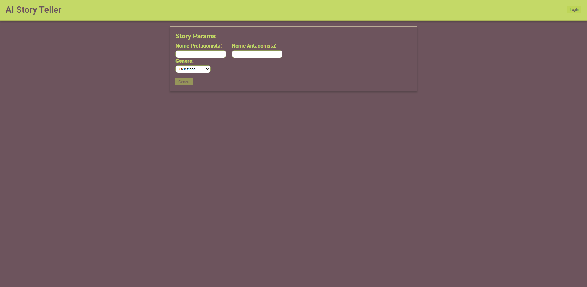
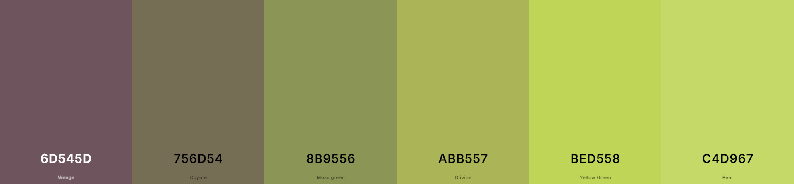

# My E-Commerce Project



## 🚀 Panoramica del Progetto

**My E-Commerce** è una semplice applicazione e-commerce costruita con un approccio atomic design. Include una pagina home per visualizzare i prodotti e una pagina carrello per gestire gli articoli aggiunti. Il progetto dimostra l'utilizzo di React, Next.js, SCSS, e altre tecnologie moderne per creare un'app scalabile e riutilizzabile.

### Funzionalità Principali

<!--
- **Pagina Home**: Visualizza i prodotti scaricati da un server. Permette di aggiungere prodotti al carrello.
- **Pagina Carrello**: Mostra i prodotti aggiunti al carrello, con possibilità di rimuovere articoli e aggiornare la visualizzazione.
- **Persistenza dei Dati**: Utilizza `localStorage` per memorizzare e recuperare i dati del carrello tra le pagine.
- **Navigazione**: Utilizza Next.js per gestire le pagine e la navigazione. -->

## 🛠️ Tecnologie Utilizzate

- **React**: Per costruire l'interfaccia utente e gestire lo stato dell'applicazione.
- **Next.js**: Per la gestione delle pagine e della navigazione lato server.
- **SCSS**: Per la stilizzazione dell'applicazione e utilizzo di mixin e funzioni.
- **CSS Modules**: Per uno styling modulare e locale.



## 📂 Struttura del Progetto

```bash
src/
├── components/
│   ├── Atoms/
│   │   ├── Button/
│   │   └── Input/
│   ├── Molecules/
│   │   ├── Header/
│   │   └── SelectBox/
│   └── Organisms/
│       └── WindowBox/
├── constants/
├── pages/
│   └── nuova-pagina/
├── styles/
│   └── default/
│       ├── _functions.scss
│       ├── _mixins.scss
├── types/
├── .eslintrc.json
├── .gitignore
└── next-env.d.ts

_____________________________________________________


src/
├── components/
│   ├── Atoms/
│   │   └── Button/
│   │   │   ├── Button.module.scss
│   │   │   └── Button.tsx
|       └── Input/
│   │       ├── Input.module.scss
│   │       └── Input.tsx
│   ├── Molecules/
│   │   ├── Header/
│   │   │   ├── Header.module.scss
│   │   │   └── Header.tsx
│   │   └── SelectBox/
│   │       ├── SelectBox.module.scss
│   │       └── SelectBox.tsx
│   └── Organism/
│       └── WindowBox/
│           ├── WindowBox.module.scss
│           └── WindowBox.tsx
├── constants/
│   └── common.ts
├── pages/
│   └── api/
│       └── hello.ts
│   └── nuova-pagina/
│       ├── index.tsx
│       ├── _app.tsx
│       ├── _document.tsx
│       └── index.tsx
├── styles/
│   └── default/
│       ├── _functions.scss
│       ├── _mixins.scss
│       ├── index.scss
│       └── globals.scss
│   └── Home.module.css
├── types/
│   └── common.ts
├── .eslintrc.json
├── .gitignore
├── LICENSE
└── next-env.d.ts


V metodi e mixin sass
V inserire campi input -> atom
V inserire select -> atom
- inserire switch (per definire bambino/adulto e condizionare l'output) -> atom
- hamburger menu
- carousel

✨ Miglioramenti 
Implementare lo switch: Aggiungere un componente switch per selezionare tra bambino/adulto e condizionare l'output.
Aggiungere Hamburger Menu: Creare un menu mobile friendly per la navigazione.
Inserire un Carousel: Mostrare più prodotti in una slider dinamica.

